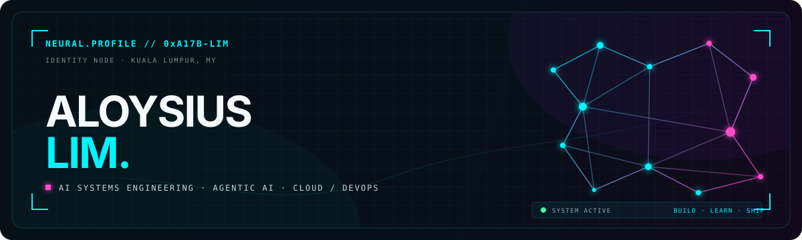

<div align="center">
  <a href="https://aloysiuslim.dev/">
    
  </a>

  <br />

  [](https://aloysiuslim.dev/)
  [](https://www.linkedin.com/in/aloysius-lim-ming-zhou/)
  [](https://www.instagram.com/aloysius.lim.xiii/)
</div>

```txt
▸ IDENTITY   aspiring AI systems engineer
▸ FOCUS      agentic AI · production AI · cloud architecture · DevOps
▸ LOCATION   Kuala Lumpur, Malaysia
▸ STATUS     building the bridge from models that work → systems that last
```

I’m a Diploma in Information Technology student who likes AI beyond the notebook: the serving layer, the infrastructure, the observability, and all the engineering that makes a model useful in the real world. I learn by building—from neural networks and RAG pipelines to multimodal accessibility tools and cloud-native applications.

## `01 / SELECTED NODES`

<table>
  <tr>
    <td width="50%" valign="top">
      <br/>
      <p><strong><a href="https://github.com/AloysiusLimMingZhou/ResearchOps">◆ ResearchOps</a></strong></p>
      <p>AI engineering project for practical, production-minded RAG with LangChain.</p>
      <p><code>RAG</code> <code>LangChain</code> <code>AI Engineering</code></p>
    </td>
    <td width="50%" valign="top">
      <br/>
      <p><strong><a href="https://github.com/AloysiusLimMingZhou/signal-room-interview-coach">◆ Signal Room</a></strong></p>
      <p>A Gemini-first, real-time technical interview coach.</p>
      <p><code>Gemini</code> <code>Realtime AI</code> <code>TypeScript</code></p>
    </td>
  </tr>
  <tr>
    <td width="50%" valign="top">
      <br/>
      <p><strong><a href="https://github.com/AloysiusLimMingZhou/EduSign-Bridge">◆ EduSign Bridge</a></strong></p>
      <p>AI-powered, real-time bidirectional voice ↔ hand-sign system built for KitaHack 2026.</p>
      <p><code>Multimodal AI</code> <code>Accessibility</code> <code>Dart</code></p>
      <br/>
    </td>
    <td width="50%" valign="top">
      <br/>
      <p><strong><a href="https://github.com/AloysiusLimMingZhou/Neural-Network-From-Scratch">◆ Neural Network From Scratch</a></strong></p>
      <p>A two-hidden-layer neural network derived from the math and trained on MNIST.</p>
      <p><code>Python</code> <code>NumPy</code> <code>Deep Learning</code></p>
      <br/>
    </td>
  </tr>
</table>

<div align="right">
  <a href="https://aloysiuslim.dev/#projects"><code>EXPLORE THE FULL PROJECT GRAPH ↗</code></a>
</div>

## `02 / SYSTEM MAP`

| Field | Nodes I reach for |
| :--- | :--- |
| **AI / ML** | `PyTorch` · `TensorFlow` · `Hugging Face` · `scikit-learn` |
| **Agentic systems** | `LangChain` · `RAG` |
| **Applications** | `Next.js` · `NestJS` · `React` · `TypeScript` · `Java` |
| **Platform / DevOps** | `Docker` · `Linux` · `AWS` · `GCP` |
| **Security toolkit** | `Wireshark` · `Burp Suite` · `Nmap` · `CyberChef` · `Volatility` |

## `03 / FIELD SIGNALS`

```txt
2026  ◆  FINALIST   Qwen Brainrot Hackathon
2026  ◆  BRONZE     MAHSA Engineering, Science & Technology Exhibition · IT
2025  ◆  TOP 10     National AI Competition
```

- **Head of Education · Sunway Tech Club** — leading the department and its technical learning events.
- **Event Department Sub-Director · Sunway Analytics Society** — taking events from idea to post-mortem.
- **Research Intern · HUMAC** — explored deep reinforcement learning for autonomous hexapod locomotion over uneven terrain.

## `04 / TELEMETRY`

<div align="center">
  
  
  
</div>

## `05 / OPEN CHANNEL`

I’m interested in internships, hackathons, and collaborations around **AI systems, agents, MLOps, cloud infrastructure, and useful real-world products**.

<div align="center">
  <a href="https://aloysiuslim.dev/"><strong>PORTFOLIO</strong></a>
  &nbsp;·&nbsp;
  <a href="https://www.linkedin.com/in/aloysius-lim-ming-zhou/"><strong>LINKEDIN</strong></a>
  &nbsp;·&nbsp;
  <a href="https://github.com/AloysiusLimMingZhou?tab=repositories"><strong>ALL REPOSITORIES</strong></a>
</div>
